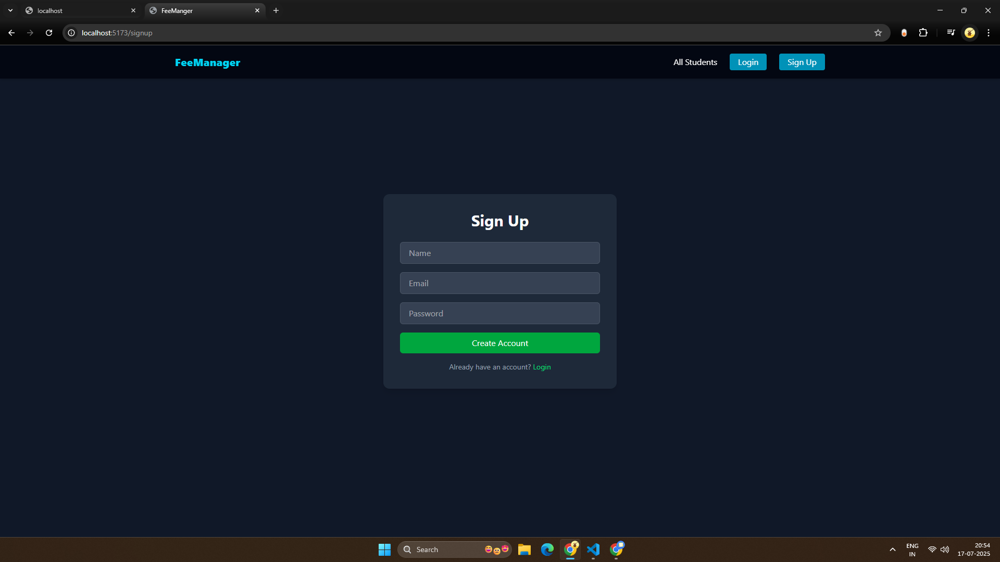
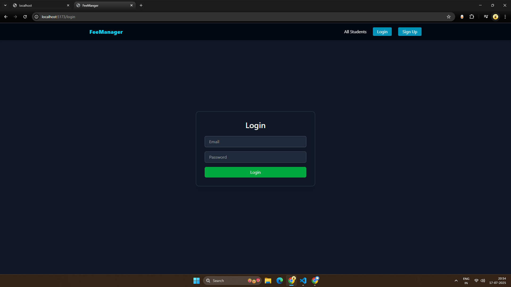
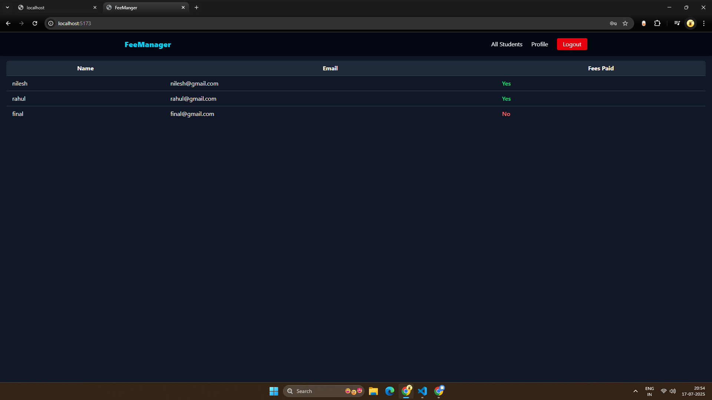
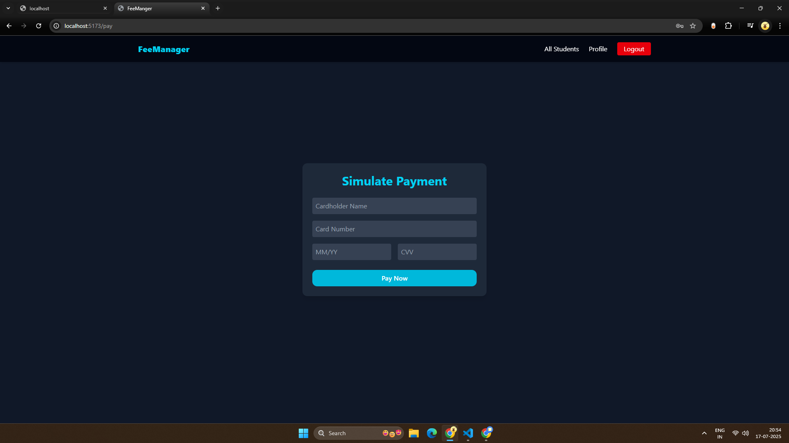
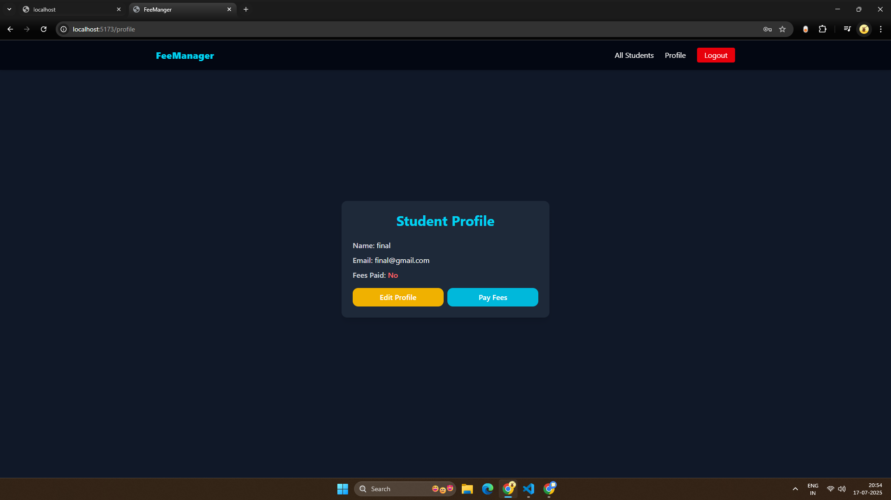

# 🎓 Student Fee Management System

A full-stack web application for managing student fee payments, built using **MERN Stack** (MongoDB, Express, React, Node.js).

---

## ✨ Features

### 🔐 Authentication
- Login & Signup using JWT
- Secure routes with auth middleware

### 👤 Student Features
- View & edit profile (name, email)
- Simulate fee payment
- Real-time payment status update

---

## 🧱 Project Structure

```
/student-fee-system
├── backend/             # Express API
└── frontend/            # React UI (Vite + Tailwind)
```

---

## 📁 Backend (Node.js + Express)

### 📦 Setup

```bash
cd backend
npm install
```

### 🔐 Create `.env`

```
PORT=5000
MONGO_URI=your_mongodb_uri
JWT_SECRET=your_jwt_secret
```

### 🚀 Start Server

```bash
npm run dev     # development with nodemon
npm start       # production
```

### 🔌 API Endpoints

#### Auth
- `POST /api/auth/signup` – Register new student
- `POST /api/auth/login` – Login & return JWT

#### Students
- `GET /api/students/me` – Get logged-in student's data
- `PUT /api/students/me` – Update student profile
- `PUT /api/students/pay` – Simulate payment

### 🔐 Auth Headers

```http
Authorization: Bearer <your_token_here>
```

---

## 🎨 Frontend (React + Tailwind)

### ⚙️ Setup

```bash
cd frontend
npm install
npm run dev
```

### 📂 Pages

- `/login` – Login screen
- `/signup` – Registration screen
- `/home` – Dashboard/Home
- `/profile` – Student profile
- `/pay` – Simulate fee payment

### 🌈 Theme
- Tailwind CSS for styling
- Responsive and mobile-friendly

---

## 📸 UI Screenshots

| Login | Profile | Payment |
|-------|---------|---------|
|  |  |  |
| |  |

---

## 🛠️ Built With

- **MongoDB** & Mongoose
- **Express.js**
- **React (Vite)**
- **Node.js**
- **JWT**
- **Tailwind CSS**
- **Axios**

---

## 📂 Folder Summary

```
/backend
├── controllers/
├── middleware/
├── models/
├── routes/
├── index.js
└── .env

/frontend
├── pages/
├── components/
├── api/
├── App.jsx
└── main.jsx
```

---

## 💡 Future Enhancements

- Payment gateway integration
- Admin panel to manage students
- Email notifications on payment

---
